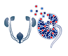

# GUDMAP/RBK
This is the home of public documentation for the GUDMAP/RBK Consortiums. Click [Wiki](https://github.com/informatics-isi-edu/gudmap-rbk/wiki) for 
the documentation landing page. 

If you find anything that needs correcting or have suggestions for more documentation, please send email to:
- For GUDMAP: help@gudmap.org
- For RBK: help@rebuildingakidney.org

# Using GUDMAP/RBK
* [Using the GUDMAP/RBK Data Browser](Using-the-GUDMAP-RBK-Data-Browser)
* [Uploading Files using Deriva Client Tools](Uploading-files-via-Deriva-client-tools)
* [Batch Query](Batch-Query)

# Submitting Data
* [Antibodies](Submitting-Antibodies)
* [Cell Lines](Submitting-Cell-Lines)
* [Data Collections](Submitting-Data-Collections)
* [Histology Data](Submitting-Specimen-Data)
* [Immunofluorescence Images](Submitting-Specimen-Data)
* [Protocols](Submitting-Protocols)
* [Sequencing Data](Submitting-Sequencing-Data)
* [Single Cell Visualization Files](Submitting-Single-Cell-Visualization-Files)
* [Specimens](Submitting-Specimen-Data)

# Data Submission Process
* [Curation Workflow](Curation-Workflow)
* [Reviewing Data for Release](Reviewing-Data)

# Images and Videos
* [Thumbnail creation guideline](Thumbnail-creation-guideline)
* [Available Video Platforms](Video-Players)

# Access
* [Accessing GUDMAP and RBK Resources](Accessing-GUDMAP-and-RBK-Resources)
* [Uploading files via Deriva client tools](https://github.com/informatics-isi-edu/gudmap-rbk/wiki/Uploading-files-via-Deriva-client-tools)

# Data Publication and Citation
* [How to create a collection and citation for publications](Data-publication-and-citation)
* [Shortcut URLs for citation and sharing](Shortcut-URLs-for-citation-and-sharing)

# Data Model
* [Data submission curation state diagram](Data-submission---curation-state-diagram)
* [RBK Data Submission Workshop 2017_06_12](Data-Submission-Workshop-2017_06_12)
